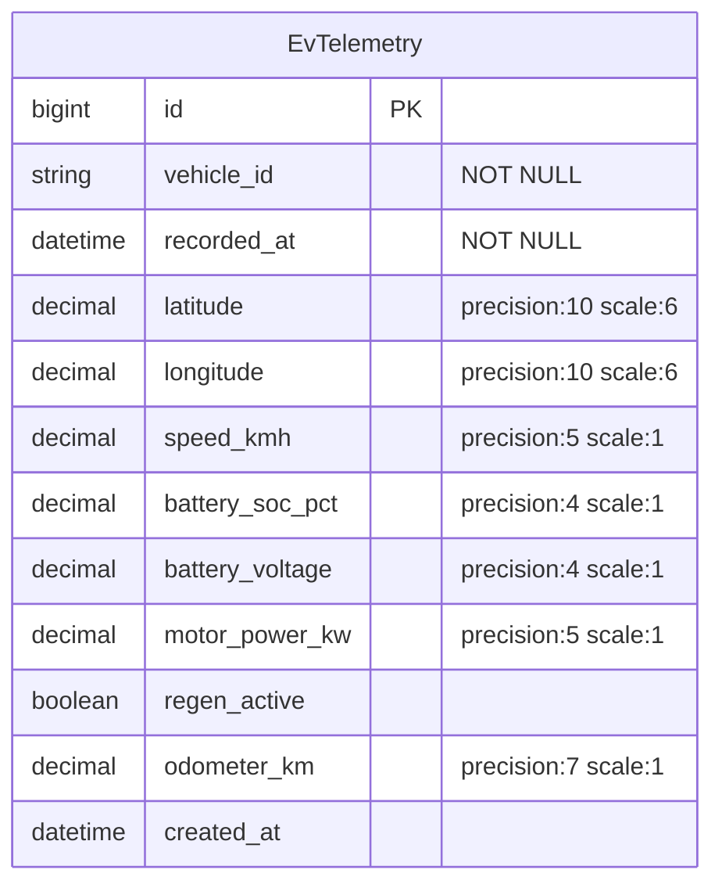

# feat: Add EvTelemetry model and Shoryuken worker

## Overview

SQS(ElasticMQ) `explained-default` 큐에서 EV telemetry JSON 메시지를 수신하여 PostgreSQL에 저장하는 기능 구현. `EvTelemetry` 모델(flat 컬럼)과 Shoryuken Worker로 구성.

## Brainstorm Reference

`docs/brainstorms/2026-03-13-ev-telemetry-model-worker-brainstorm.md`

## Key Design Decisions

| Decision | Choice | Rationale |
|---|---|---|
| 모델명 | `EvTelemetry` | EV 텔레메트리 데이터를 명확히 표현 |
| Job 타입 | Shoryuken Worker (NOT ActiveJob) | 기존 인프라와 직접 연동, ActiveJob 레이어 불필요 |
| DB 스키마 | Flat 컬럼 | 쿼리/인덱싱 용이, JSONB는 YAGNI |
| `timestamp` 필드명 | `recorded_at` | SQL 예약어 충돌 방지, Rails 컨벤션 준수 |
| 인덱스 | `[vehicle_id, recorded_at]` 복합 인덱스 (unique) | 차량별 시계열 쿼리 지원 + 중복 메시지 방지 |
| 에러 처리 | rescue & log (poison pill 방지) | `RecordInvalid`, `RecordNotUnique` → 로그 후 discard. JSON 파싱은 수동 처리 |
| 중복 처리 | unique index + rescue `RecordNotUnique` | SQS at-least-once 대응, 중복은 로그 후 무시 |

## ERD



## Implementation Tasks

### Task 1: Migration 생성

**File:** `db/migrate/YYYYMMDDHHMMSS_create_ev_telemetries.rb`

- [x] `rails generate model EvTelemetry` 로 생성 (첫 번째 마이그레이션)
- [x] 컬럼 정의:

| Column | Type | Constraints |
|---|---|---|
| vehicle_id | `string` | `null: false` |
| recorded_at | `datetime` | `null: false` |
| latitude | `decimal` | `precision: 10, scale: 6` |
| longitude | `decimal` | `precision: 10, scale: 6` |
| speed_kmh | `decimal` | `precision: 5, scale: 1` |
| battery_soc_pct | `decimal` | `precision: 4, scale: 1` |
| battery_voltage | `decimal` | `precision: 4, scale: 1` |
| motor_power_kw | `decimal` | `precision: 5, scale: 1` |
| regen_active | `boolean` | |
| odometer_km | `decimal` | `precision: 7, scale: 1` |
| created_at | `datetime` | `t.datetime :created_at, default: -> { "CURRENT_TIMESTAMP" }` (updated_at 제외 — append-only 데이터) |

- [x] 복합 unique 인덱스: `add_index :ev_telemetries, [:vehicle_id, :recorded_at], unique: true`
- [x] `rails db:migrate` 실행

### Task 2: EvTelemetry 모델

**File:** `app/models/ev_telemetry.rb`

- [x] `vehicle_id`, `recorded_at` presence validation
- [x] 최소한의 모델 — 불필요한 validation/scope 추가하지 않음

### Task 3: Shoryuken Worker

**File:** `app/workers/ev_telemetry_worker.rb`

- [x] `include Shoryuken::Worker`
- [x] `shoryuken_options queue: "explained-default", auto_delete: true`
- [x] `body_parser` 사용하지 않음 — `perform` 내에서 `JSON.parse` 수동 처리 (poison pill 제어를 위해)
- [x] 명시적 필드별 매핑 (hash slice 금지):
  ```ruby
  def perform(_sqs_msg, body)
    payload = JSON.parse(body)
    EvTelemetry.create!(
      vehicle_id:      payload["vehicle_id"],
      recorded_at:     payload["timestamp"],
      latitude:        payload["latitude"],
      longitude:       payload["longitude"],
      speed_kmh:       payload["speed_kmh"],
      battery_soc_pct: payload["battery_soc_pct"],
      battery_voltage: payload["battery_voltage"],
      motor_power_kw:  payload["motor_power_kw"],
      regen_active:    payload["regen_active"],
      odometer_km:     payload["odometer_km"]
    )
  end
  ```
- [x] 에러 처리:
  - `JSON::ParserError` → 잘못된 JSON, error 로그 후 무시 (re-raise 안 함)
  - `ActiveRecord::RecordNotUnique` → 중복 메시지, debug 로그 후 무시
  - `ActiveRecord::RecordInvalid` → 잘못된 데이터, error 로그 후 무시
  - 기타 예외 → propagate (Shoryuken이 retry 처리)
- [x] 성공 시 debug 레벨 로깅

### Task 4: 테스트

**Files:** `test/models/ev_telemetry_test.rb`, `test/workers/ev_telemetry_worker_test.rb`

- [x] 모델 테스트:
  - `vehicle_id`, `recorded_at` presence validation
  - 복합 unique index: 동일 vehicle_id + recorded_at 중복 insert 시 `RecordNotUnique`
- [x] Worker 테스트:
  - Happy path: 유효한 JSON → DB 저장 확인
  - 중복 메시지: `RecordNotUnique` rescue 후 에러 없이 무시
  - 잘못된 JSON: `JSON::ParserError` rescue 후 에러 없이 무시
  - 필수 필드 누락: `RecordInvalid` rescue 후 에러 없이 무시

### Task 5: E2E 검증

- [ ] `rake sqs:simulate_telemetry` → Shoryuken worker → PostgreSQL 저장 확인
- [ ] 변경 불필요 — 기존 rake task는 그대로 호환됨

## Acceptance Criteria

- [ ] `rails db:migrate` 성공, `ev_telemetries` 테이블 생성
- [ ] `EvTelemetry.create!(vehicle_id: "EV-KR-00001", recorded_at: Time.current)` 성공
- [ ] Shoryuken worker가 `explained-default` 큐에서 메시지를 수신하여 DB에 저장
- [ ] 중복 메시지 수신 시 에러 없이 무시
- [ ] 잘못된 JSON/데이터 수신 시 에러 로그 후 무시 (무한 retry 방지)
- [ ] E2E: `rake sqs:simulate_telemetry` → Shoryuken worker → PostgreSQL 저장 확인

## File Summary

| File | Action |
|---|---|
| `db/migrate/XXX_create_ev_telemetries.rb` | 생성 |
| `app/models/ev_telemetry.rb` | 생성 |
| `app/workers/ev_telemetry_worker.rb` | 생성 |
| `test/models/ev_telemetry_test.rb` | 생성 |
| `test/workers/ev_telemetry_worker_test.rb` | 생성 |

## References

- Brainstorm: `docs/brainstorms/2026-03-13-ev-telemetry-model-worker-brainstorm.md`
- SQS Client: `lib/sqs_client.rb`
- Shoryuken Config: `config/shoryuken.yml`
- Shoryuken Initializer: `config/initializers/shoryuken.rb`
- Telemetry Seeder: `lib/tasks/sqs.rake`
- ElasticMQ Config: `config/elasticmq.conf`
- Kamal Worker Role: `config/deploy.yml`
